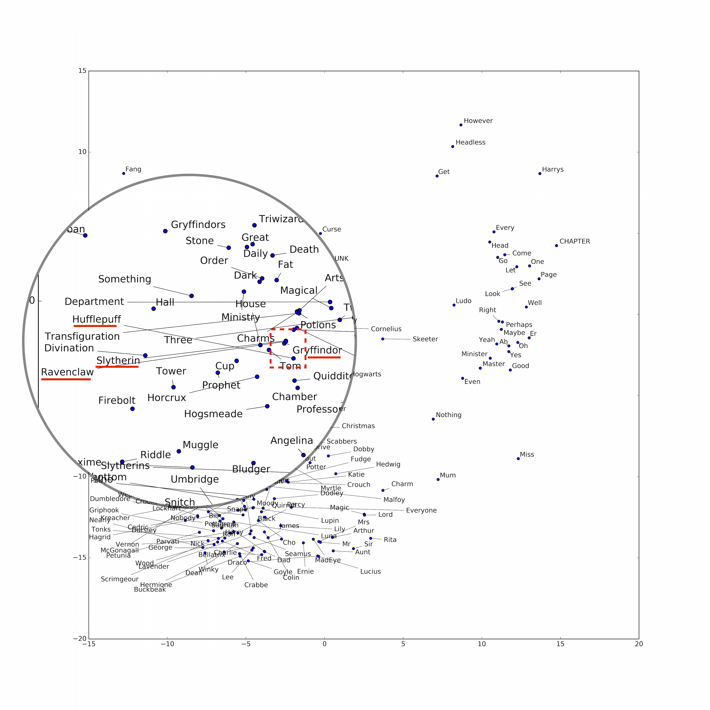

# word2vec4everything

Processing some interesting text documents through the word2vec model.

## word2vec

Put simply, word2vec, as explained in [Wikipedia](https://en.wikipedia.org/wiki/Word2vec), refers to a number of machine learning models that accept a body of text and outputs a vector space of word embeddings.
The resulting word vectors can be visualized in such a way that words with similiar semantic meanings and contexts are clustered together.

As word2vec is an unsupervised machine learning technique, the input text source does not require any labels.

## Dependencies

This project implements word2vec using Google's TensorFlow library.

- Python 2.x
- TensorFlow

## Gallery

**All 7 Harry Potter books**

word2vec clusters the 4 houses of Hogwarts together.

